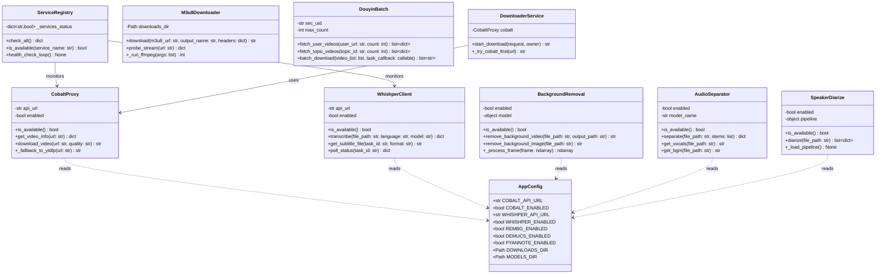
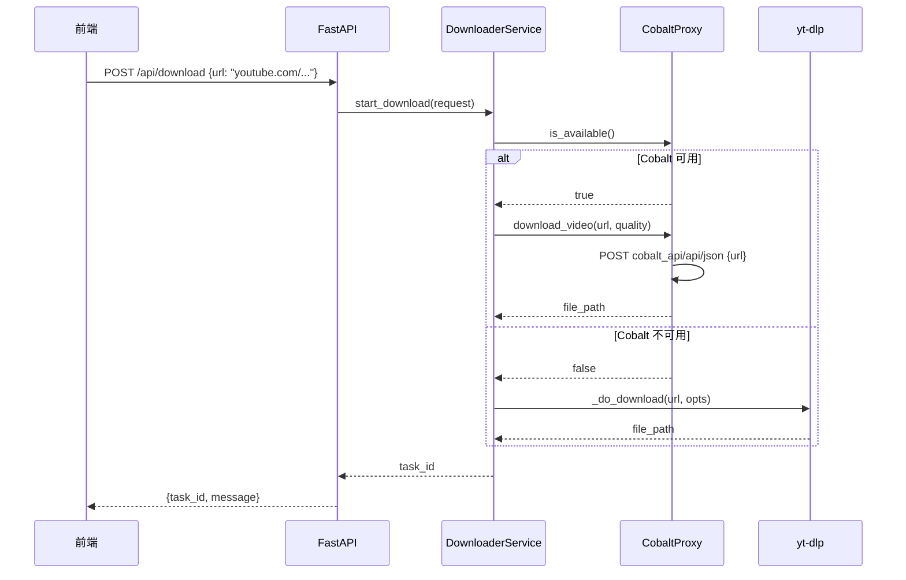
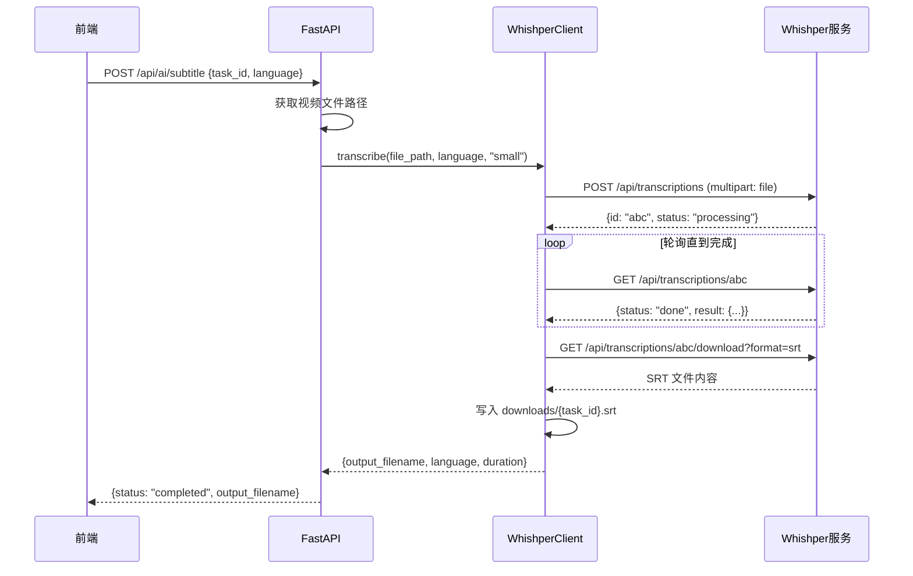
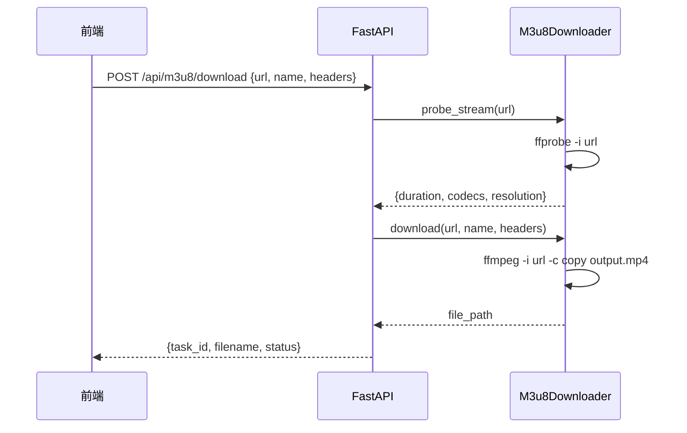
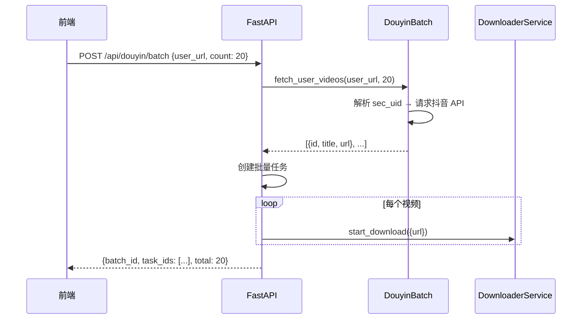
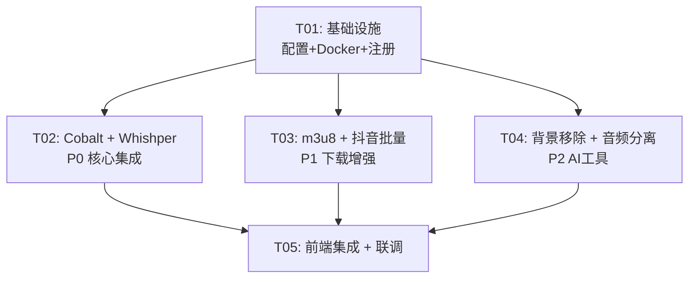

# SnapVid 多服务集成 — 系统设计文档

## Part A: 系统设计

### 1. 实现方案

#### 核心技术挑战

| 挑战 | 解决方案 |
|------|----------|
| 中国大陆环境无法直连 YouTube/Twitter | Cobalt 作为可选外部代理，缺失时优雅降级 |
| AI 字幕需要较大模型 + GPU | Whishper (FasterWhisper) CPU 模式 + small/base 模型 |
| m3u8/HLS 流下载 | 复用容器内已有 ffmpeg 直接处理 |
| AI 背景移除模型 170MB | rembg 作为可选 pip 依赖，启动时懒加载 |
| 音频分离模型较大 | demucs 作为 P2 可选服务，环境变量控制开关 |

#### 架构选型

| 组件 | 选型 | 理由 |
|------|------|------|
| 容器编排 | Docker Compose (profiles) | 按 profile 分组，`--profile ai` 启用 AI 服务 |
| 视频代理 | Cobalt (self-hosted) | imputnet/cobalt 官方 Docker 镜像，REST API |
| AI 字幕 | Whishper | 封装 FasterWhisper，自带 REST API + Web UI |
| m3u8 下载 | ffmpeg (内置) | 零新依赖，复用现有 ffmpeg |
| 背景移除 | rembg (Python) | 轻量，可选安装 |
| 音频分离 | demucs (Python) | Facebook 开源，效果佳 |
| 说话人识别 | pyannote-audio | 学术级精度，HuggingFace 托管模型 |

#### 架构模式

```
┌─────────────────────────────────────────────────┐
│                  docker-compose                  │
│                                                  │
│  ┌──────────────────────────────────────────┐   │
│  │           app (FastAPI + React)           │   │  ← 主容器
│  │    port: 9090 → 8080                      │   │
│  │    volumes: downloads, cookies, models     │   │
│  └──────────────┬────────────┬──────────────┘   │
│                 │            │                    │
│       ┌────────▼──┐   ┌────▼──────────┐        │
│       │  cobalt   │   │   whishper    │         │  ← 可选服务
│       │  :9001    │   │   :9002       │         │
│       │ profile:  │   │   profile:    │         │
│       │  proxy    │   │   ai          │         │
│       └───────────┘   └──────────────┘          │
└─────────────────────────────────────────────────┘
```

所有新服务通过 **环境变量 + Docker Compose profiles** 控制：
- `COBALT_ENABLED=true` / `COBALT_API_URL=http://cobalt:9000`
- `WHISHPER_ENABLED=true` / `WHISHPER_API_URL=http://whishper:8080`
- `REMBG_ENABLED=true`
- `DEMUCS_ENABLED=true`

---

### 2. 文件列表

```
ytdlp-web/
├── docker-compose.yml              # [修改] 新增 cobalt/whishper 服务定义
├── .env.example                    # [新增] 环境变量模板
├── Dockerfile                      # [修改] 新增 rembg/demucs 可选依赖层
├── backend/
│   ├── main.py                     # [修改] 注册新路由、启动时探测服务可用性
│   ├── requirements.txt            # [修改] 新增 rembg, demucs, pyannote 可选依赖
│   ├── api/
│   │   ├── routes.py               # [修改] 新增 m3u8/抖音批量/AI工具路由
│   │   └── schemas.py              # [修改] 新增请求/响应 Schema
│   ├── services/
│   │   ├── cobalt_proxy.py         # [新增] Cobalt API 客户端 + 降级逻辑
│   │   ├── whishper_client.py      # [新增] Whishper API 客户端，返回 SRT
│   │   ├── m3u8_downloader.py      # [新增] ffmpeg m3u8/HLS 下载服务
│   │   ├── douyin_batch.py         # [新增] 抖音主页/话题批量下载
│   │   ├── background_removal.py   # [新增] rembg 视频背景移除
│   │   ├── audio_separator.py      # [新增] demucs 人声/BGM 分离
│   │   ├── speaker_diarize.py      # [新增] pyannote 说话人识别
│   │   ├── service_registry.py     # [新增] 统一服务探测 & 健康检查
│   │   ├── douyin_fallback.py      # [修改] 增强批量能力
│   │   ├── downloader.py           # [修改] 集成 cobalt_proxy 降级链
│   │   └── ai_tools.py            # [修改] 连接 whishper + rembg
│   └── config.py                   # [新增] 集中环境变量配置
├── frontend/
│   └── src/
│       └── components/
│           └── dashboard/
│               ├── Toolbox.jsx     # [修改] 新增工具入口
│               └── M3u8Panel.jsx   # [新增] m3u8 下载 UI
└── docs/
    └── system_design.md            # 本文档
```

---

### 3. 数据结构与接口



---

### 4. 程序调用流程

#### 4.1 Cobalt 代理下载流程



#### 4.2 Whishper AI 字幕流程



#### 4.3 m3u8 下载流程



#### 4.4 抖音批量下载流程



---

### 5. 未确定事项

| 项目 | 说明 | 假设 |
|------|------|------|
| Cobalt 部署位置 | 需要外网服务器 | 设计为可选，compose 中定义但默认不启动 |
| Whishper 模型选择 | base (74MB) vs small (244MB) | 默认用 small，环境变量可选 base |
| pyannote 授权 | 需要 HuggingFace token | 作为 P2 可选，用户自行配置 token |
| 抖音 API 频控 | 可能被限速/封禁 | 内置 safe_mode 间隔 + 随机 delay |

---

## Part B: 任务分解

### 6. 需新增的依赖

#### 后端 (Python — requirements.txt 追加)

```
# P0 - 已有 requests，无新增 (cobalt/whishper 均通过 HTTP API)
httpx>=0.27.0                # 异步 HTTP 客户端 (替代 requests 异步场景)

# P1 - m3u8 无新增 (用 ffmpeg subprocess)

# P2 - 可选安装
rembg[gpu]==2.0.57           # AI 背景移除 (可选, ~170MB 模型)
demucs>=4.0.1                # BGM/人声分离 (可选, ~300MB 模型)
pyannote.audio>=3.1.0        # 说话人识别 (可选, 需 HF token)
torch>=2.1.0                 # demucs/pyannote 依赖 (可选)
```

#### 前端 (无新增 npm 依赖)

现有 React + TailwindCSS + Vite 足够，新 UI 均为组件扩展。

---

### 7. 任务列表

#### T01: 基础设施 — 配置中心 + Docker Compose + 服务注册

| 字段 | 值 |
|------|-----|
| **优先级** | P0 |
| **依赖** | 无 |
| **源文件** | `docker-compose.yml`, `.env.example`, `backend/config.py`, `backend/services/service_registry.py`, `Dockerfile`, `backend/requirements.txt` |

**内容：**
- 新建 `backend/config.py` 集中管理所有环境变量（Cobalt URL、Whishper URL、feature flag）
- 新建 `backend/services/service_registry.py` 实现统一服务探测（启动时 + 周期性 health check）
- 修改 `docker-compose.yml` 新增 cobalt/whishper 服务定义（profiles 隔离）
- 新增 `.env.example` 模板
- `Dockerfile` 增加可选依赖层（多阶段构建）
- `requirements.txt` 追加 httpx

---

#### T02: Cobalt 代理 + Whishper 字幕集成 (P0)

| 字段 | 值 |
|------|-----|
| **优先级** | P0 |
| **依赖** | T01 |
| **源文件** | `backend/services/cobalt_proxy.py`, `backend/services/whishper_client.py`, `backend/services/downloader.py`, `backend/services/ai_tools.py`, `backend/api/routes.py`, `backend/api/schemas.py` |

**内容：**
- 新建 `cobalt_proxy.py`: Cobalt REST API 封装 + 降级到 yt-dlp
- 新建 `whishper_client.py`: 上传音频 → 轮询状态 → 获取 SRT
- 修改 `downloader.py`: `start_download` 中先尝试 Cobalt
- 修改 `ai_tools.py`: `generate_subtitles` 改为调用 Whishper
- 修改 `routes.py` + `schemas.py`: 完善 AI 字幕端点参数

---

#### T03: m3u8 下载 + 抖音批量增强 (P1)

| 字段 | 值 |
|------|-----|
| **优先级** | P1 |
| **依赖** | T01 |
| **源文件** | `backend/services/m3u8_downloader.py`, `backend/services/douyin_batch.py`, `backend/services/douyin_fallback.py`, `backend/api/routes.py`, `backend/api/schemas.py`, `frontend/src/components/dashboard/Toolbox.jsx` |

**内容：**
- 新建 `m3u8_downloader.py`: 用 ffmpeg 处理 m3u8 URL，支持自定义 headers
- 新建 `douyin_batch.py`: 抖音主页批量 + 话题批量，借鉴 TikTokDownloader 思路
- 修改 `douyin_fallback.py`: 增加 sec_uid 解析、分页获取视频列表
- routes/schemas 新增 m3u8 和抖音批量端点
- Toolbox.jsx 增加 m3u8 输入框和抖音批量入口

---

#### T04: AI 背景移除 + 音频分离 (P2)

| 字段 | 值 |
|------|-----|
| **优先级** | P2 |
| **依赖** | T01 |
| **源文件** | `backend/services/background_removal.py`, `backend/services/audio_separator.py`, `backend/services/speaker_diarize.py`, `backend/api/routes.py`, `backend/api/schemas.py`, `frontend/src/components/dashboard/Toolbox.jsx` |

**内容：**
- 新建 `background_removal.py`: rembg 逐帧处理，支持视频 + 图片
- 新建 `audio_separator.py`: demucs 分离人声和 BGM
- 新建 `speaker_diarize.py`: pyannote 说话人识别
- routes/schemas 新增 3 个 AI 处理端点
- Toolbox 新增 3 个工具卡片

---

#### T05: 前端集成 + 端到端联调

| 字段 | 值 |
|------|-----|
| **优先级** | P1 |
| **依赖** | T02, T03, T04 |
| **源文件** | `frontend/src/components/dashboard/Toolbox.jsx`, `frontend/src/components/dashboard/M3u8Panel.jsx`, `frontend/src/App.jsx`, `backend/main.py`, `docker-compose.yml` |

**内容：**
- 新建 `M3u8Panel.jsx`: m3u8 链接输入 + 进度显示
- 修改 `Toolbox.jsx`: 完整集成所有新工具 UI
- 修改 `App.jsx`: 路由/Tab 适配新面板
- 修改 `main.py`: 注册 service_registry 启动探测 + 新路由
- 最终 docker-compose.yml 联调验证

---

### 8. 共享知识 (跨任务约定)

```
1. 所有 API 响应统一格式: {status, message, data?, error?}
2. 可选服务通过环境变量开关: COBALT_ENABLED, WHISHPER_ENABLED, REMBG_ENABLED, DEMUCS_ENABLED
3. 服务不可用时必须优雅降级，返回友好提示而非 500
4. AI 处理类接口统一采用异步任务模式: 提交 → 返回 task_id → 轮询/WebSocket 推进度
5. 所有新文件需处理 downloads_dir 路径，使用 config.py 中的 DOWNLOADS_DIR
6. 大模型/大文件首次使用时懒加载，不在容器启动时自动下载
7. Docker Compose profiles: default(仅 app), proxy(+cobalt), ai(+whishper), full(all)
8. 前端调用新 API 前先检查 /api/services/status 确认后端能力
```

---

### 9. 任务依赖图



---

## 附录: API 设计详情

### Cobalt 代理 API

```
POST /api/download
  新增逻辑: 当 URL 匹配 youtube/twitter/instagram 时优先走 Cobalt
  降级: Cobalt 不可用 → 回退 yt-dlp → 返回友好错误

GET /api/services/status
  返回: {cobalt: bool, whishper: bool, rembg: bool, demucs: bool}
```

### Whishper 字幕 API

```
POST /api/ai/subtitle
  参数: task_id (str), language (str: auto|zh|en|ja), model (str: base|small), format (str: srt|vtt|ass)
  返回: {task_id, status, output_filename, duration_seconds, word_count}
  
GET /api/ai/subtitle/status/{subtitle_task_id}
  返回: {status: processing|completed|failed, progress: float}
```

### m3u8/HLS 下载 API

```
POST /api/m3u8/probe
  参数: {url: str, headers?: dict}
  返回: {duration, resolution, codecs, estimated_size}

POST /api/m3u8/download
  参数: {url: str, output_name?: str, headers?: dict}
  返回: {task_id, message}
```

### 抖音批量下载 API

```
POST /api/douyin/batch
  参数: {
    user_url?: str,       # 用户主页链接
    topic_id?: str,       # 话题 ID
    count: int,           # 最大数量 (max 50)
    audio_only: bool
  }
  返回: {batch_id, task_ids: [str], total: int, skipped: int}

GET /api/douyin/batch/{batch_id}
  返回: {total, completed, failed, tasks: [{id, title, status}]}
```

### AI 背景移除 API

```
POST /api/ai/background-remove
  参数: {task_id: str, output_format: str (mp4|webm|gif)}
  返回: {task_id, status, output_filename, frames_processed}

GET /api/ai/background-remove/status/{ai_task_id}
  返回: {status, progress, eta}
```

### 音频分离 API

```
POST /api/ai/audio-separate
  参数: {task_id: str, stems: [str] (vocals|drums|bass|other)}
  返回: {task_id, status, outputs: {vocals: filename, bgm: filename}}

POST /api/ai/speaker-diarize
  参数: {task_id: str}
  返回: {task_id, speakers: [{id, label, segments: [{start, end}]}]}
```

---

## 附录: docker-compose.yml 更新方案

```yaml
version: '3.8'

services:
  app:
    build:
      context: .
      dockerfile: Dockerfile
      args:
        INSTALL_AI_DEPS: ${INSTALL_AI_DEPS:-false}
    ports:
      - "9090:8080"
    environment:
      - ENV=development
      - PORT=8080
      - JWT_SECRET=${JWT_SECRET:-snapvid_dev_secret_2026_secure_key_min32bytes}
      # 服务集成配置
      - COBALT_ENABLED=${COBALT_ENABLED:-false}
      - COBALT_API_URL=http://cobalt:9000
      - WHISHPER_ENABLED=${WHISHPER_ENABLED:-false}
      - WHISHPER_API_URL=http://whishper:8080
      - REMBG_ENABLED=${REMBG_ENABLED:-false}
      - DEMUCS_ENABLED=${DEMUCS_ENABLED:-false}
    volumes:
      - downloads:/app/downloads
      - models:/app/models
    depends_on:
      cobalt:
        condition: service_started
        required: false
      whishper:
        condition: service_started
        required: false
    restart: unless-stopped

  cobalt:
    image: ghcr.io/imputnet/cobalt:latest
    profiles: ["proxy", "full"]
    ports:
      - "9001:9000"
    environment:
      - API_URL=http://cobalt:9000
    restart: unless-stopped

  whishper:
    image: pluja/whishper:latest-cpu
    profiles: ["ai", "full"]
    ports:
      - "9002:8080"
    environment:
      - WHISPER_MODELS_DIR=/app/models
      - WHISHPER_DEFAULT_MODEL=small
    volumes:
      - whishper_models:/app/models
      - downloads:/app/uploads
    restart: unless-stopped

volumes:
  downloads:
  models:
  whishper_models:
```

**端口规划:**

| 服务 | 容器内端口 | 宿主映射 | Profile |
|------|-----------|----------|---------|
| app (SnapVid 主服务) | 8080 | 9090 | default |
| cobalt | 9000 | 9001 | proxy |
| whishper | 8080 | 9002 | ai |
